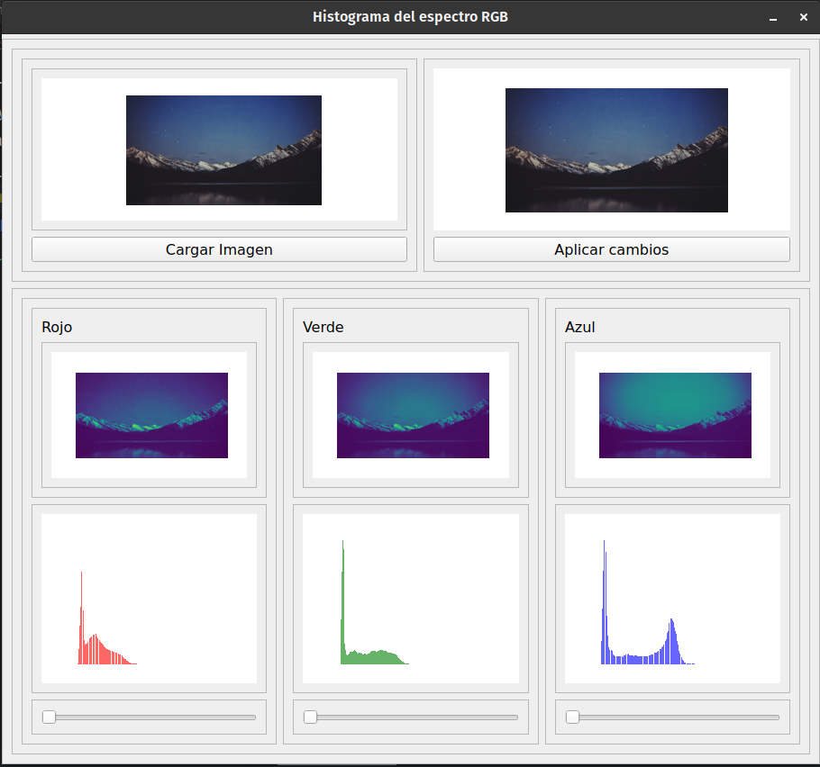

# Editor espectros rgb python
 Editor de los espectros rgb de una imagen construida con python y QT5
 

## Instalacion del entorno
* Se requiere python = 3.8.16
puedes verificar tu version de python con
```
python --version
```

todas las dependencias estan en requirements.txt ejecuta el siguiente comando para instalarlas
```
pip install -r requirements.txt
```
